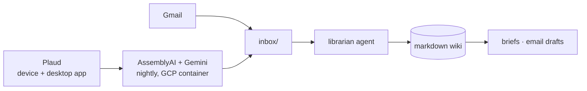

# An LLM Knowledge Base That Files Your Meetings and Drafts Your Email

**Who it's for.** People who sit in a lot of meetings and want AI to handle the aftermath: the notes, the follow-ups, the CRM updates, the rest of the paperwork.

**How it's going (one month in).** 209 sources, 545 cited claims, 790 cross-links, ~387k words. None of it written by me. It briefs me before every meeting and drafts my email in my voice.

## What it fixes

I record most of my meetings and calls and keep a pile of notes and email. My AI tools couldn't see any of it, so every question started from a blank slate and every follow-up was manual.

## How it's wired

One pipeline captures everything I say. In-person meetings record on the Plaud device; virtual meetings record through the Plaud desktop app. Both land in the same inbox.

**Import.** Audio is transcribed (AssemblyAI), structured (Gemini), and dropped in an inbox. A second job pulls real email threads into the same place.

**Ingest.** Each night an agent files new sources into the wiki by a written schema (`schema.md`). Meetings verbatim; insights distributed to people, project, and concept pages; every claim cites its transcript.

**Export.** My agents read the wiki: a brief on everyone before a meeting, email replies drafted in my voice. I send. The agent never does.

**Code or prompt?** Both, split cleanly. The capture half is code: a containerized job on a free GCP VM (systemd timer) that watches a Drive folder for new Plaud audio, calls the AssemblyAI and Gemini APIs, and rclone-syncs the structured notes back to the inbox. The wiki half is prompt: the librarian and the drafter are scheduled LLM agents that follow `schema.md`, with no bespoke code.

**The rules that keep it honest:**

- Meetings stored verbatim, never edited.
- Every claim cites its source file.
- One page per thing; the agent merges, never duplicates.
- Ambiguity goes to a review queue, not a guess.

## Build your own

Copy `schema.md` into a folder, open it with a coding agent (Claude Code, Codex), and adapt the page types and rules to your life. Drop sources into an inbox, tell the agent to ingest, read the result in Obsidian. Run it by hand first; wire the capture job and a nightly schedule once it earns its keep. See `examples/` for a sample page pair.

## Credit

Built on Andrej Karpathy's [LLM wiki idea file](https://gist.github.com/karpathy/442a6bf555914893e9891c11519de94f).

---

*This repo: the write-up, a sanitized schema (`schema.md`), and one synthetic example (`examples/`). The real vault has real names in it and stays on my machine.*
